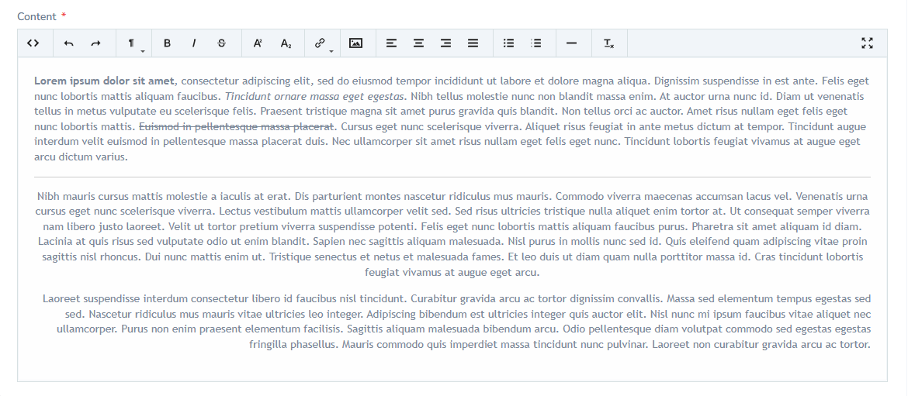
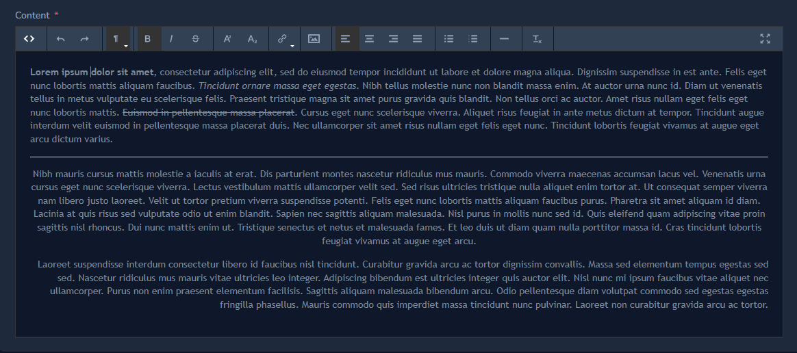

# Nova Trumbowyg Field

<picture>
    <source media="(prefers-color-scheme: dark)" srcset="https://banners.beyondco.de/Nova%20Trumbowyg%20Field.png?pattern=topography&style=style_2&fontSize=100px&md=1&showWatermark=1&theme=dark&packageManager=composer+require&packageName=mr-vaco%2Fnova-trumbowyg-field&description=Trumbowyg+WYSIWYG+editor&images=https%3A%2F%2Flaravel.com%2Fimg%2Flogomark.min.svg">
    
</picture>

> [RU readme](./README.RU.md)

# Trumbowyg (WYSIWYG editor) with localization!

This component adds the ability to use WYSIWYG fields instead of standard Textarea or Trix fields.

Component Base:

- [Trumbowyg WYSIWYG editor](https://github.com/Alex-D/Trumbowyg) - the editor himself
- [Vue.js component for Trumbowyg WYSIWYG editor](https://github.com/ankurk91/vue-trumbowyg) - binding for use with Vue JS

To switch localizations you can use [Language Switch](https://github.com/badinansoft/nova-language-switch)

## Install

```
composer require mr-vaco/nova-trumbowyg-field
```

## How to use it in your component

Language is detected automatically - `app()->getLocale()`

```php
use MrVaco\NovaTrumbowygField\NovaTrumbowygField;

public function fields(NovaRequest $request): array
{
    return [
        NovaTrumbowygField::make('Your field name', 'db column'),
    ];
}
```

## List of available localizations

> "en" - English - by default

|                  |                             |                       |                              |                             |
|------------------|-----------------------------|-----------------------|------------------------------|-----------------------------|
| ar - Arabic      | es - Spanish                | it - Italian          | pt - Portuguese              | th - Thai                   |
| az - Azerbaijani | es_ar - Spanish (Argentina) | ja - Japanese         | pt_br - Portuguese Brazilian | tr - Turkish                |
| bg - Bulgarian   | et - Estonian               | ko - Korean           | ro - Romanian                | ua - Ukrainian              |
| bn - Bangla      | fa - Persian                | lt - Lithuanian       | rs - Serbian (Cyrlic)        | vi - Vietnamese             |
| by - Belarusian  | fi - Finnish                | mn - Mongolian        | rs_latin - Serbian (Latin)   | zh_cn - Simplified Chinese  |
| ca - Catalan     | fr - French                 | my - Malaysian        | ru - Russian                 | zh_tw - Traditional Chinese |
| cs - Czech       | he - Hebrew                 | nb - Norwegian Bokmål | sk - Slovak                  |                             |
| da - Danish      | hr - Croatian               | nl - Dutch            | sl - Slovenian               |                             |
| de - German      | hu - Hungarian              | ph - Filipino         | sq - Albanian                |                             |
| el - Greek       | id - Indonesian             | pl - Polish           | sv - Swedish                 |                             |

I did not translate - all localization files were taken from [Trumbowyg repository](https://github.com/Alex-D/Trumbowyg/tree/develop/src/langs).

Each localization file indicates the author of the translation.

---




